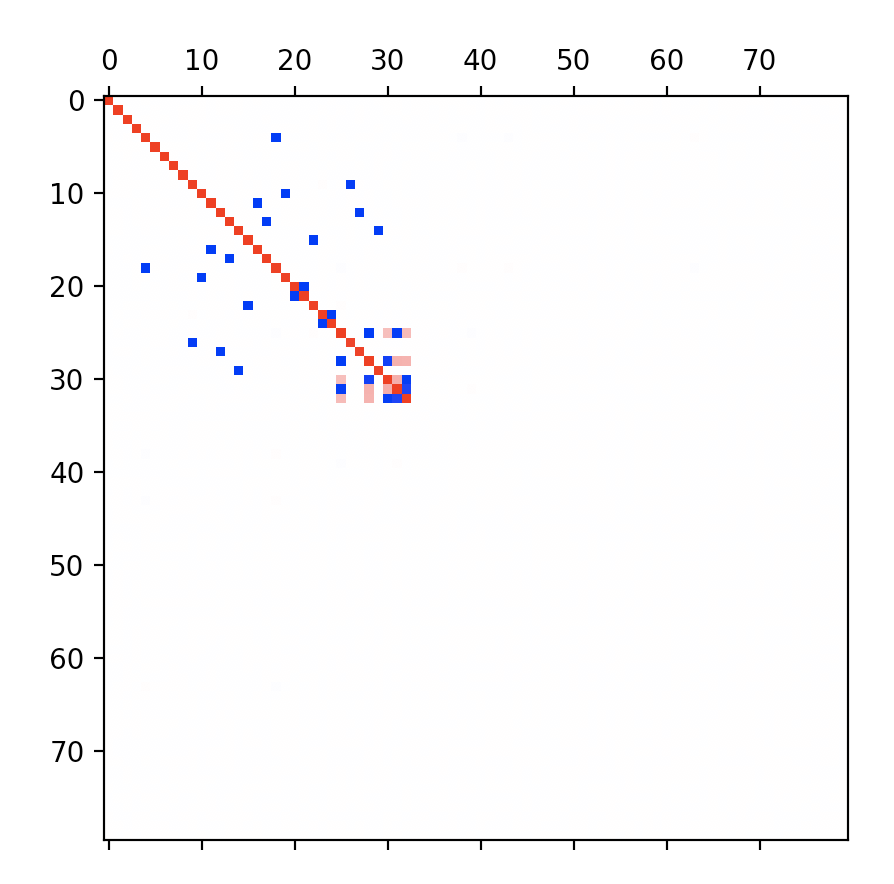

# Toy Models of Superposition Replication
Independent replication of the basic results and phase diagram of [Toy Models of Superposition](https://transformer-circuits.pub/2022/toy_model/index.html) by Elhage et al. See the paper for the interpretation of the following graphs.

The toy superposition model at sparsity = 0:

At sparsity = 0.9:

At sparsity = 0.999:

The phase diagram for m=2 and n=1:

